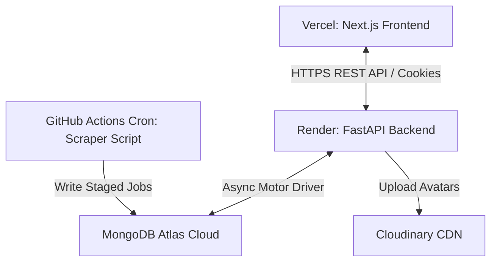

# Software Requirements Specification (SRS)
## For HireArc — Modern Job Aggregator & Automated Scraping Platform

---

### Document Control
| Version | Date | Author | Description |
| :--- | :--- | :--- | :--- |
| 1.0.0 | May 22, 2026 | Antigravity AI | Initial baseline Software Requirements Specification (SRS) |

---

## 1. Introduction

### 1.1 Purpose
This document specifies the software requirements for the HireArc (formerly JobSphere) application. It details the functional requirements, non-functional attributes, system interfaces, security structures, and database schemas for both the Next.js frontend and the FastAPI backend. It serves as the single source of truth for developer integration, quality assurance testing, and system verification.

### 1.2 Scope
HireArc is a modern, high-performance job board aggregator that automatically fetches, normalizes, and showcases software engineering vacancies from multiple corporate career panels. 
The system consists of:
1. **Frontend App**: Next.js 16 Web Application utilizing React 19, TypeScript, and Tailwind CSS.
2. **Backend API**: FastAPI REST service utilizing async MongoDB drivers (Motor) and JWT session management.
3. **Automated Scraper**: GitHub Actions workflow executing every 6 hours, scraping job vacancies, parsing experience levels, salary distributions, and saving records to MongoDB.

### 1.3 Definitions, Acronyms, and Abbreviations
* **SRS**: Software Requirements Specification
* **API**: Application Programming Interface
* **JWT**: JSON Web Token
* **OAuth**: Open Authorization Protocol (Google & GitHub)
* **Motor**: Asynchronous Python driver for MongoDB
* **CDN**: Content Delivery Network (Cloudinary)
* **CI/CD**: Continuous Integration / Continuous Deployment (GitHub Actions)
* **DOM**: Document Object Model

### 1.4 References
* Next.js 16 Documentation: [https://nextjs.org](https://nextjs.org)
* FastAPI Framework Documentation: [https://fastapi.tiangolo.com](https://fastapi.tiangolo.com)
* MongoDB Manual: [https://www.mongodb.com/docs](https://www.mongodb.com/docs)
* IEEE Std 830-1998: IEEE Recommended Practice for Software Requirements Specifications

### 1.5 Overview
The rest of this document outlines the product features, user profiles, operating environments, constraints, functional specifications, database models, and security requirements.

---

## 2. Overall Description

### 2.1 Product Perspective
HireArc operates as a distributed, decoupled web application. The frontend runs server-side rendering (SSR) and client-side interactions on Vercel. The backend runs asynchronously on Render, communicating with a MongoDB Atlas cloud database. The data collection layer operates via decoupled scraper scripts triggered via GitHub Actions runners.



### 2.2 Product Functions
The primary functions of the HireArc platform include:
1. **Job Ingestion & Normalization**: Automatically scrape corporate jobs, extract metadata (salary, locations, job types, tags), and store them.
2. **Global Search & Filter Matrix**: Fetch search inputs and run text searches or filters on job type, salary range, and company.
3. **User Management & Authentication**: Authenticate users via Google/GitHub OAuth and manage secure sessions via `httpOnly` secure cookies.
4. **Developer Portfolio & Saved Jobs**: Allow seekers to save jobs, track active applications, and complete developer profiles.
5. **Administrative Panel**: Manage user authorizations, toggle job posting states, delete obsolete listings, and inspect scraping logs.

### 2.3 User Classes and Characteristics
* **Job Seekers (Public & Authenticated)**: Developers looking for jobs. Can browse, filter, search, view company profiles, sign in via OAuth, save listings, edit their personal profile, and view application statuses.
* **Administrators (Clearance Level)**: System operators. Access the `/admin` dashboard to inspect ingestion statistics, view access control logs, change user authorization roles, delete jobs, toggle job states (propagating vs offline), and read scraping logs.
* **Automated Scraper System (System Actor)**: Operates asynchronously. Parses job postings, cleans text data, resolves coordinates/tags, and upserts listings.

### 2.4 Operating Environment
* **Frontend Runtime**: Browser environment (Chrome 90+, Safari 14+, Firefox 88+, Edge 90+) and Node.js 18+ for server-side compilation.
* **Backend Runtime**: Python 3.11+ environment on Linux containers.
* **Database**: MongoDB v6.0+ cluster.
* **CI/CD Platform**: GitHub Actions runner environments (Ubuntu-latest).

### 2.5 Design and Implementation Constraints
* **Framework Constraint**: Frontend must use React 19 and Next.js 16 App Router.
* **State Management**: Authentication state must reside in secure `httpOnly` JWT tokens to protect against Cross-Site Scripting (XSS) attacks.
* **Data Access**: Async operations are mandatory. All FastAPI database calls must utilize the `Motor` driver with `async`/`await` commands.
* **UI Design Theme**: Layout styles must follow the Zinc design system, characterized by glassmorphism, Waldenburg Light serif typography for headers, and Inter font for body elements.

### 2.6 User Documentation
Users can find installation guides and deployment details in the repository `README.md` files:
* Frontend Guide: [jobsphere-next/README.md](file:///d:/Web%20Engineering/jobsphere-next/README.md)
* Backend Guide: [jobsphere-backend/README.md](file:///d:/Web%20Engineering/jobsphere-backend/README.md)

### 2.7 Assumptions and Dependencies
* **Third-Party OAuth APIs**: Google API console and GitHub OAuth configurations are operational.
* **Cloud Database Uptime**: MongoDB Atlas clusters maintain high availability (>99.9% SLA).
* **Scraping Target Domains**: Target corporate career domains do not drastically change their HTML structural schemas, allowing the parser to extract relevant selectors.

---

## 3. System Features (Functional Requirements)

### 3.1 User Authentication & Session Management
* **Description**: Users register and log in securely using OAuth 2.0 social endpoints.
* **Functional Requirements**:
  * **FR-1.1**: The system shall offer single-click authentication via Google and GitHub OAuth endpoints.
  * **FR-1.2**: Upon successful OAuth handshake, the system shall generate a JWT Access Token (expires in 15 minutes) and a JWT Refresh Token (expires in 7 days).
  * **FR-1.3**: The backend shall set tokens in `httpOnly`, `Secure`, `SameSite=Lax` cookies, preventing Javascript scope accessibility.
  * **FR-1.4**: The backend shall expose a `/api/auth/refresh` endpoint to exchange valid refresh cookies for new access tokens.
  * **FR-1.5**: The system shall support a clean logout endpoint `/api/auth/logout` which invalidates the local session cookies.

### 3.2 Job Search, Filtering, and Aggregation
* **Description**: Users search and filter the compiled database of scraped listings.
* **Functional Requirements**:
  * **FR-2.1**: The search system shall match queries against job titles, company names, and tags.
  * **FR-2.2**: The filtering panel shall restrict lists by Job Type (Full-time, Part-time, Contract, Internship), Location (Remote, Hybrid, Onsite), and Salary ranges.
  * **FR-2.3**: The system shall load job pages dynamically using cursor-based pagination (default 20 records per cluster).
  * **FR-2.4**: The system shall retrieve individual company pages containing company descriptions, benefits, and active vacancies.

### 3.3 User & Developer Profiles
* **Description**: Users manage their personal developer cards and bookmark list.
* **Functional Requirements**:
  * **FR-3.1**: Authenticated users shall be able to save and unsave job vacancies. Bookmarks must persist in the `users` database collection.
  * **FR-3.2**: Users shall be able to upload profile avatars. The backend shall handle file uploads, route them to Cloudinary CDN, and update the user record with the Cloudinary URL.
  * **FR-3.3**: Users shall be able to edit personal fields (full name, phone, resume text, skill tags) in their account section.

### 3.4 Admin Control Panel & Scraping Logs
* **Description**: Administrators manage system health and user access clearance levels.
* **Functional Requirements**:
  * **FR-4.1**: Only authenticated users with the database role `admin` shall be allowed to access any `/api/admin/*` endpoints.
  * **FR-4.2**: Admins shall be able to view a global list of registered users and delete user nodes.
  * **FR-4.3**: Admins shall be able to update user authorization roles (escalate/de-escalate between `user`, `company`, and `admin`).
  * **FR-4.4**: Admins shall be able to toggle the active state of any job vacancy. Inactive jobs shall be excluded from search queries.
  * **FR-4.5**: Admins shall be able to inspect a chronological log of scraper activity, listing sync durations, job counts, and status (Success/Failure).

### 3.5 Asynchronous Automated Ingestion (Web Scraper)
* **Description**: Periodic background jobs fetch and sync active job listings.
* **Functional Requirements**:
  * **FR-5.1**: The scraper script shall trigger automatically every 6 hours via GitHub Actions workflow scheduler.
  * **FR-5.2**: The scraper shall parse target job pages, extract details (Title, Company, Location, Description, Apply URL, Salary, and Posting Date).
  * **FR-5.3**: The scraper shall clean data and upsert into the MongoDB collection using `company` and `original_id`/`apply_url` as compound keys to prevent duplicates.
  * **FR-5.4**: The scraper shall generate a `ScrapingLog` record upon completion, compiling the total records fetched, individual company statistics, and runtime status.

---

## 4. External Interface Requirements

### 4.1 User Interfaces
The system interface enforces a high-fidelity editorial aesthetic:
* **Base Typography**: Display headlines utilize `Waldenburg Light` at weight 300. Body elements run `Inter` at weight 400 or 500 with loose tracking (+0.16px).
* **Color System**: Monochromatic warm colors built on a Zinc scale (Off-white background `#f5f5f5`, Ink text `#0c0a09`, Card surface `#ffffff`).
* **Visual FX**: WebGL/Canvas dot-field interactivity (`DotField.tsx`) responsive to mouse hover, and smooth animated page transitions using `framer-motion`.

### 4.2 Hardware Interfaces
No specialized hardware interfaces are required. The system runs on standard cloud compute virtual machines (Vercel serverless edges, Render Linux containers, MongoDB Atlas shared shards).

### 4.3 Software Interfaces
* **Frontend-to-Backend Interface**: Uses standard JSON REST endpoints over HTTPS.
* **Backend-to-Database Interface**: Asynchronous connection using the Python `motor.motor_asyncio` package.
* **Backend-to-CDN Interface**: Uses the Cloudinary Python SDK v1.36.0+ to perform secure multipart image file uploads.

### 4.4 Communications Interfaces
* **Protocol**: HTTP/1.1 and HTTP/2 over TLS 1.3 (HTTPS) for all communications.
* **CORS Policies**: Restricted cross-origin resource sharing. The backend accepts calls exclusively from the configured `FRONTEND_URL`.
* **OAuth Redirection**: Communicates with Google and GitHub endpoints using TLS-secured state variables to prevent CSRF attacks.

---

## 5. Non-Functional Requirements

### 5.1 Performance Requirements
* **API Response Time**: Non-aggregating read queries (e.g. search pages, job details) must resolve in <200ms under normal load (100 concurrent requests).
* **Static Page Optimization**: Next.js App Router must compile pages as static HTML where possible, yielding Google Lighthouse Performance scores >= 90.
* **Async Ingestion Isolation**: The scraper runs in a separate process container (GitHub runner), preventing database sync processes from blocking frontend request processing.

### 5.2 Safety Requirements
* **Data Recovery**: Automated daily snapshots of MongoDB Atlas cluster data.
* **Scraper Rate Limiting**: The scraper must incorporate random timeouts (2–5 seconds) between page parses to prevent server exhaustion on crawled domains.

### 5.3 Security Requirements
* **CSRF Protection**: Access tokens must be stored in secure, HttpOnly, SameSite=Lax cookies, making them inaccessible to client-side scripts.
* **Input Sanitization**: Pydantic models must enforce strict validation, reject malformed payloads, and strip malicious HTML/scripts from job descriptions.
* **API Rate Limiting**: Limit critical API endpoints (like search and auth callback) using SlowAPI to prevent denial-of-service (DoS) or brute-force actions.

### 5.4 Software Quality Attributes
* **Type Safety**: Frontend must run under strict TypeScript compilation mode with zero `any` declarations in production code.
* **Maintainability**: Backend must comply with PEP 8 standards. Frontend code must pass clean ESLint analysis.
* **Testability**: Maintain a local unit and integration testing suite utilizing `pytest`, keeping mock operations fully isolated.

---

## 6. Data Requirements & Schema Details

### 6.1 Database Architecture
MongoDB Atlas is utilized as the primary database storage engine.
The database consists of three main collections:
1. `users`: Stores user identity, credentials, role authorizations, and bookmarked listings.
2. `jobs`: Stores crawled job vacancy vectors, statuses, metadata, and description fields.
3. `scraping_logs`: Stores historical metrics of scraper execution cycles.

### 6.2 Data Schemas & Models

#### 6.2.1 User Collection Schema (`users`)
```json
{
  "_id": "ObjectId",
  "email": "string (unique)",
  "name": "string",
  "avatarUrl": "string",
  "role": "string (enum: 'user', 'company', 'admin')",
  "saved_jobs": ["string (job_ids)"],
  "profile": {
    "phone": "string",
    "resumeText": "string",
    "skills": ["string"]
  },
  "created_at": "ISODate"
}
```

#### 6.2.2 Job Collection Schema (`jobs`)
```json
{
  "_id": "ObjectId",
  "job_id": "string (unique)",
  "title": "string",
  "company": "string",
  "location": "string",
  "description": "string",
  "apply_url": "string (unique)",
  "job_type": "string (enum: 'Full-time', 'Part-time', 'Contract', 'Internship')",
  "experience_level": "string (enum: 'Junior', 'Mid', 'Senior', 'Lead')",
  "salary_range": "string (optional)",
  "tags": ["string"],
  "is_active": "boolean",
  "posted_at": "ISODate",
  "created_at": "ISODate"
}
```

#### 6.2.3 Scraping Log Collection Schema (`scraping_logs`)
```json
{
  "_id": "ObjectId",
  "timestamp": "ISODate",
  "status": "string (enum: 'Success', 'Failure')",
  "total_jobs": "integer",
  "duration": "string",
  "company_stats": {
    "google": "integer",
    "meta": "integer",
    "stripe": "integer",
    "figma": "integer",
    "netflix": "integer",
    "airbnb": "integer"
  }
}
```
